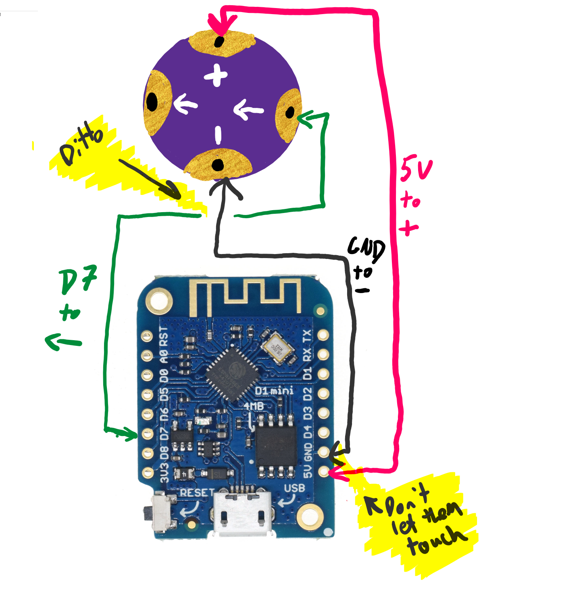
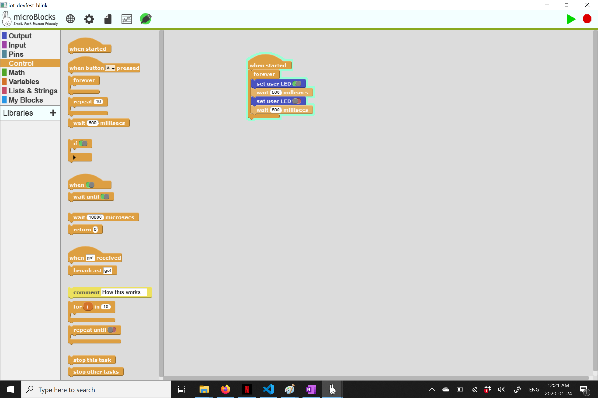
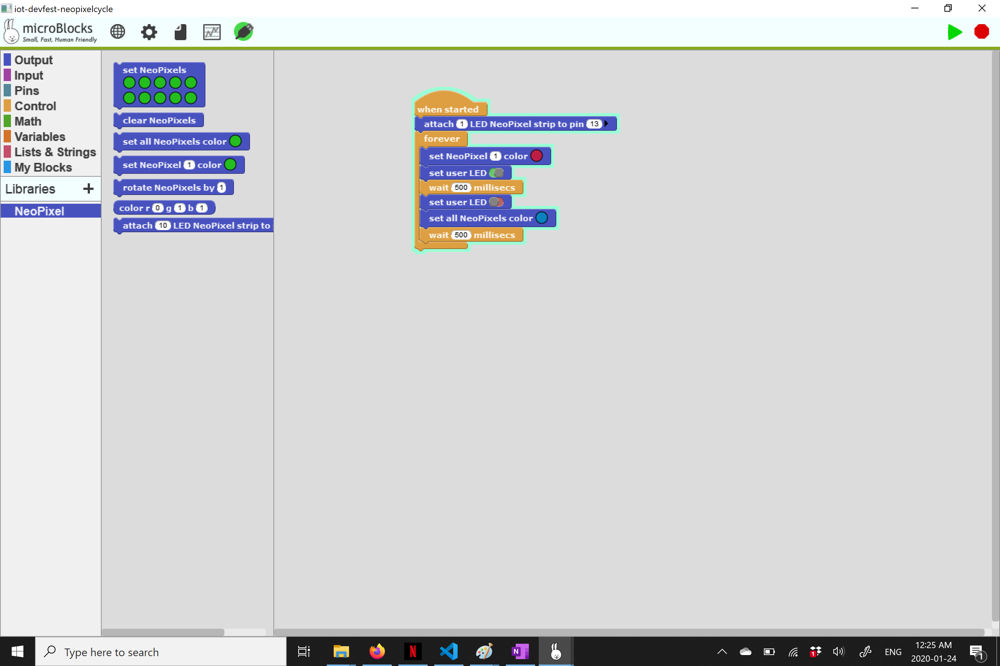
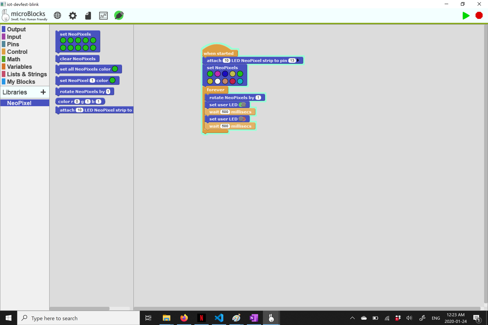

# Sewable Circuits Workshop
IoT Devfest
Pheonix Arizona
Jan 25, 2020

## Supplies Needed

* Wemos D1 Mini
* Sewable Neopixels
* Conductive Thread
* Felt
* Scissors
* Needles / Needle Threaders
* Regular Thread
* Pin Backs
* 1 Rasperry pi (for Moz WebThings gateway)

## Software

This workshop uses [MicroBlocks](http://microblocks.fun/)

## Instructions to connect Wemos to MicroBlocks

To connect the Wemos device to the the MicroBlocks platfrom, it must first be flashed with the right firmware using esptool.

Follow the instructions on the bottom of [this page](http://microblocks.fun/nodeMCUSetup.html) using the vm.ino.nodemcu.bin file found in this repo. 

Once the firmware is on the board, you should be able to plug it in, and it will automatically connect to microblocks when the app is open

## Instructions to setup Webthings 

Set up Mozilla Webthings Gateway, as described [here](https://iot.mozilla.org/gateway/)

## Schematic 

## Example Files

In this repo you will find 3 example files

1) Blink sketch
2) Simple neopixel sketch
3) Webthing blink sketch
4) You can find a WebThing example in the MicroBlocks example files

## Blink Blue Led

## Blink Neopixels

## Cycle Neopixels

## Slides

The slide deck can be found in his repo

## Additional Materials

For those interested in working with ESP8266 wirelessly, but without Webthings, there is an excellent tutorial on ESP8266 + Arduino here:  

https://tttapa.github.io/ESP8266/Chap01%20-%20ESP8266.html